## Первичный анализ и подготовка данных (`sales_land_auctions.db`)

Перед основным анализом база была изучена и приведена к рабочему виду.

**Типы данных.** `auction_date` приведена к `datetime64` (`pd.to_datetime`), `mortgage` — к `bool`, категориальные поля (`oblast`, `classificator`, `additional_classificator`, `property_type` и коды в справочниках) — к `category`.

**Пропуски.** Единственная колонка с пропусками в исходных данных — `expert_eval_price` (27 из 1596 записей, экспертная оценка проставлена не для всех лотов). Решение: **пропуски не заполнялись и не удалялись** — строки остаются в датасете для всех остальных расчётов (цена, площадь, продавец и т.д.), а в задачах, где непосредственно участвует `expert_eval_price` (сравнение с реальной ценой продажи), pandas сам корректно исключает `NaN` из агрегатов (`mean()`, `sum()` и т.д. по умолчанию работают с `skipna=True`). Обоснование: строки с пропуском во всём остальном полноценные, выбрасывать их целиком означало бы терять данные там, где они не нужны.

**Аномалия в `land_area`.** При сортировке по площади обнаружен явный выброс: лот `LSE001-UA-20230609-89341` со значением `3179.0000` га — на два порядка больше следующего по величине участка. Сверка с текстом описания лота (`lot_description`) показала указанную там площадь `3,1789` га — то есть в базу значение попало со сдвинутой на 3 знака десятичной точкой (техническая ошибка при заполнении/парсинге, судя по всему та же природа, что и у ещё нескольких похожих расхождений, найденных при сверке текста и колонки). Решение: **значение заменено на `NaN`**, а не исправлено на число из текста и не удалено строкой:
- не исправлено на 3.1789 — потому что для этого конкретного случая нет 100%-ной уверенности, что текст описания надёжнее самой колонки (в паре других найденных расхождений разница была не кратна степени десяти, то есть не всегда объясняется одной и той же технической причиной), поэтому решено не подставлять предположительно верное значение;
- строка не удалена — потому что все остальные поля лота (цена, продавец, дата, область, классификатор) корректны и нужны для расчётов, не связанных с площадью.

Таким образом `land_area` теперь содержит 1595 значений из 1596 (`isna().sum() == 1`), и этот единственный `NaN` **автоматически** выпадает из статистик по площади (`sum(min_count=1)`, `mean()` и т.п.), не затрагивая подсчёт количества лотов, сумм по ценам или группировки по продавцам/областям — ровно тот же принцип, что и с пропусками в `expert_eval_price`.

---

# Часть 2. Получение общих статистических характеристик

**Для базы данных земельных аукционов (`sales_land_auctions.db`)**

---

**Задание 1** — Суммарная площадь продаваемых участков по областям.

Реализация:
- Группировка `auctions` по `oblast`, суммирование `land_area` через `groupby(...).sum(min_count=1)`
- `min_count=1` учитывает, что в `land_area` есть один пропуск (аномальное значение 3179 га по лоту `LSE001-UA-20230609-89341` заменено на `NaN` как выброс — реальный текст описания лота указывал площадь 3,1789 га, что почти наверняка является технической ошибкой сдвига десятичной точки при заполнении базы)
- pandas, `sns.barplot` (горизонтальный, отсортирован по убыванию)

Ответ: лидируют **Одесская** (379.5 га), **Днепропетровская** (300.7 га) и **Полтавская** (294.6 га) области. У Киева (как отдельного города) — 0.83 га, минимум среди всех.

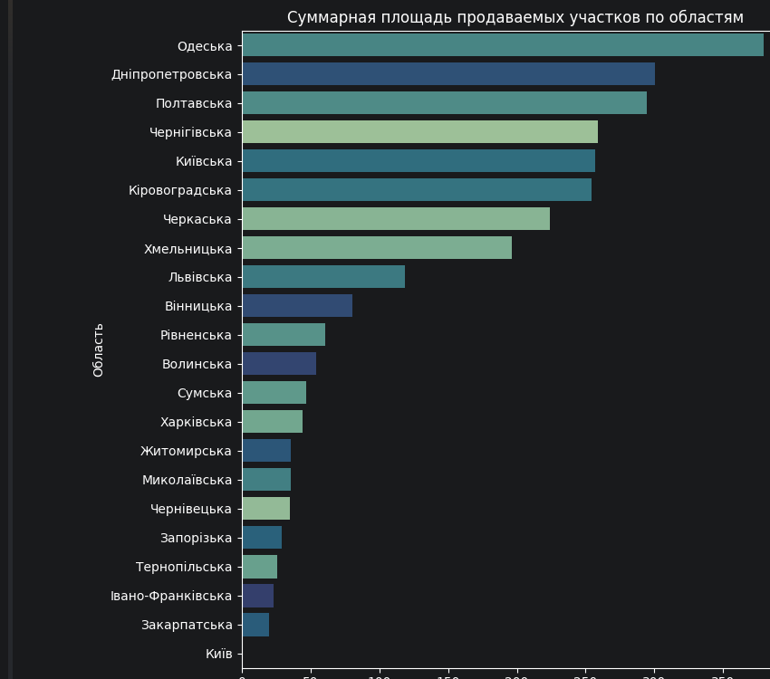

---

**Задание 2** — Суммарное количество лотов по областям.

Реализация:
- Группировка `auctions` по `oblast`, подсчёт размера группы через `groupby(...).size()`
- pandas, `sns.barplot` (горизонтальный, отсортирован по убыванию)

Ответ: больше всего лотов в **Львовской** (202), **Киевской** (182) и **Черкасской** (130) областях. Меньше всего — в Николаевской и Киеве (по 6).

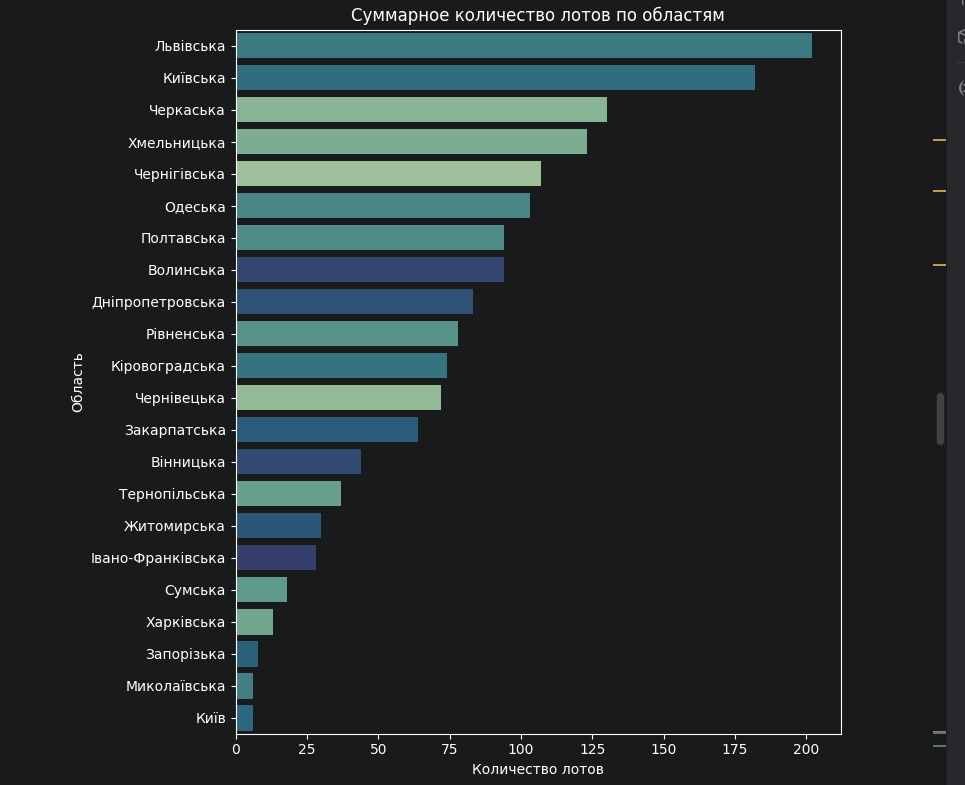

---

**Задание 3** — Зависимость суммарного количества лотов от года по областям.

Реализация:
- Год аукциона вынесен из `auction_date` (`dt.year`)
- Сводная таблица область × год через `groupby(['oblast', 'year']).size().unstack(fill_value=0)`
- `sns.heatmap` (транспонированная, годы по строкам)

Ответ: рост числа лотов год к году почти во всех областях — заметный скачок в 2023 году (например, Львовская: 14 → 70 → 118). Важная оговорка: 2021 и 2023 годы в датасете неполные (данные с 08.11.2021 по 14.11.2023), поэтому итоговые цифры за эти годы не сопоставимы напрямую с полным 2022 годом.

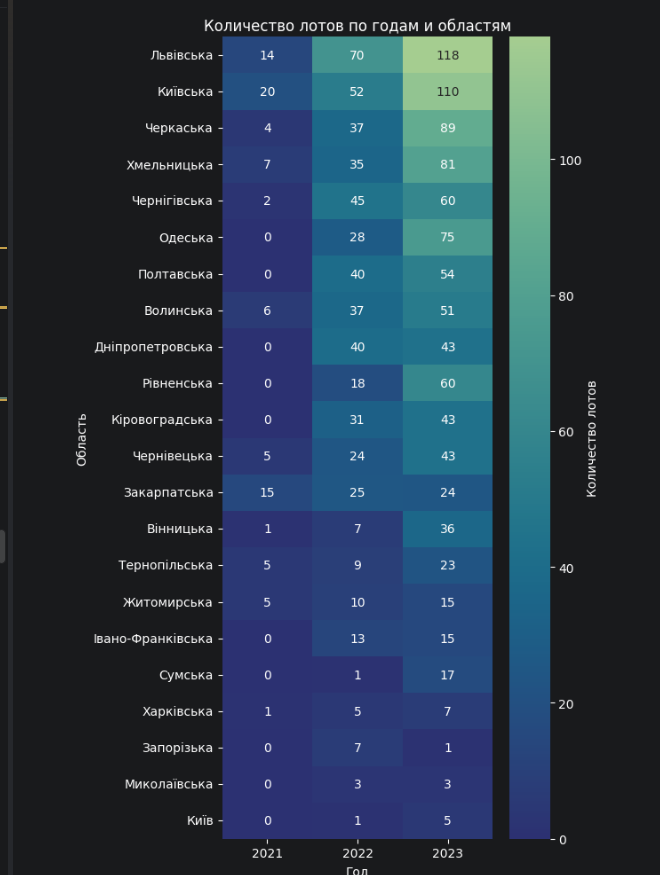

---

**Задание 4** — Какой тип земельных участков (по коду классификатора) чаще всего выставляли на продажу в каждой области.

Реализация:
- Группировка `auctions` по `['oblast', 'classificator']`, подсчёт количества
- Для каждой области выбрана строка с максимумом через `groupby('oblast')['count'].idxmax()`
- Расшифровка кода добавлена через `merge` со справочником `classificator`

Ответ: в подавляющем большинстве областей (17 из 22) чаще всего продаются **земли сельскохозяйственного назначения** (`06121000-6`). Исключения: Львовская, Закарпатская, Черновицкая, Тернопольская области — там лидируют земли общественной застройки (`06112000-0`); Волынская и Ивано-Франковская — земли промышленности (`06128000-5`); Киев — земли жилой застройки (`06111000-3`).

*(график для этого пункта не строился — 22 строки таблицы с расшифровкой достаточно наглядны сами по себе)*

---

**Задание 5** — В какой области выставлено на продажу больше всего земельных участков с предназначением «Земли под промышленную застройку» (код `011.00`).

Реализация:
- Фильтр `auctions[auctions['additional_classificator'] == '011.00']`
- Группировка по `oblast`, подсчёт количества

Ответ: **Черкасская область** — 3 лота (Черновицкая — 1, у остальных областей лотов с этим кодом нет). Стоит отметить, что сам код `011.00` в данных встречается очень редко — похожая по смыслу категория (`11.02`, `11`, `011.01`) размечена в базе непоследовательно и суммарно насчитывает гораздо больше лотов, но задание задаёт фильтр строго по коду `011.00`.

*(график для этого пункта не строился — единственное числовое сравнение по двум областям не нуждается в визуализации)*

---

**Задание 6** — Количество лотов на основе целевого предназначения земельного участка по областям.

Реализация:
- Группировка `auctions` по `['oblast', 'additional_classificator']`, сводная таблица (22 области × 57 кодов)
- Для наглядности на графике оставлены топ-10 самых частых кодов по всей базе, остальные объединены в категорию «інше»
- `sns.heatmap`

Ответ: полная таблица (22×57) приведена в ноутбуке; на графике видно, что коды `01.01`, `03.07` и `01.03` — самые массовые почти во всех областях, при этом лидеры по отдельным кодам не всегда совпадают с лидерами по общему числу лотов (например, Черкасская область резко выделяется по коду `01.01` — 70 лотов).

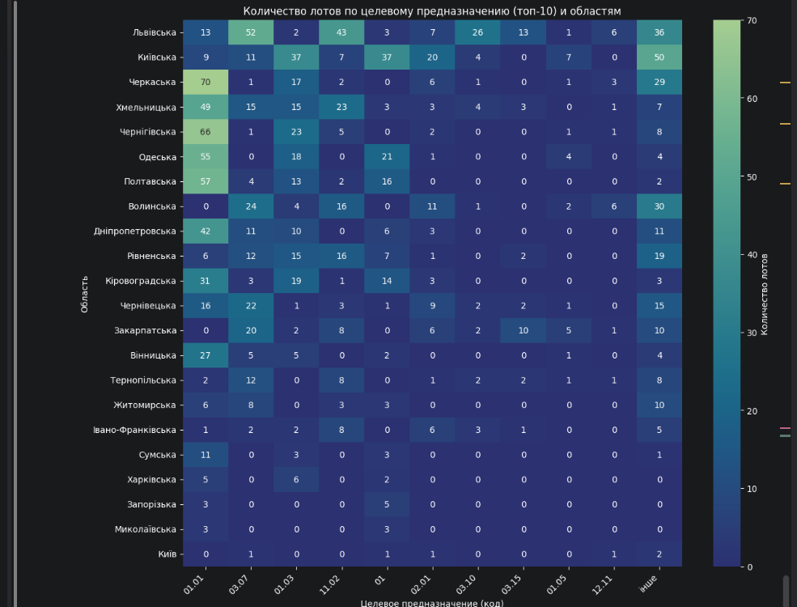


# Часть 3. Использование внешних данных. Вычисляемые значения в статистических характеристиках

---

**Задание 1** — Курс Евро (НБУ) за период дат, присутствующих в наборе данных, одним запросом.

Реализация:
- Границы периода определены из данных: `start_date = auctions['auction_date'].min()`, `end_date = auctions['auction_date'].max()`
- Один запрос к публичному API НБУ (`bank.gov.ua/NBU_Exchange/exchange_site`) с параметрами `start`, `end`, `valcode=eur` — без обращения к API на каждую запись, как и требовалось условием
- Результат — таблица `eur_rates` (дата → курс), `pd.DataFrame` из JSON-ответа, дата приведена к `datetime64`
- Визуализация — `plotly.express.line`

Ответ: получено **737 дневных значений курса** — по одному на каждый день периода с 08.11.2021 по 14.11.2023. 

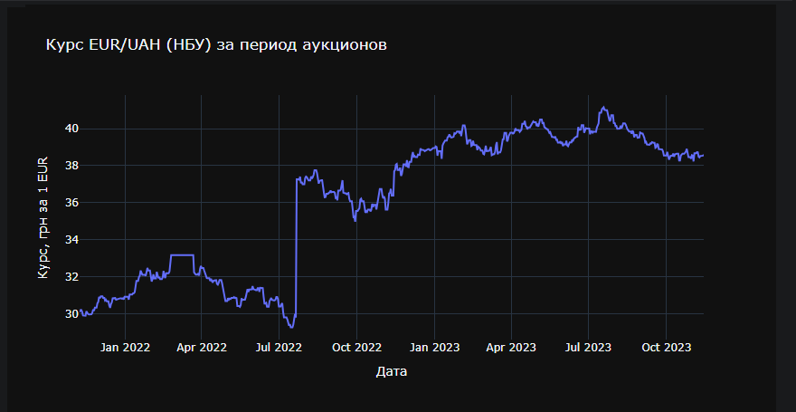

---

**Задание 2** — Пересчёт начальной, конечной и экспертной оценки стоимости участка в евро.

Реализация:
- `auctions` объединена с `eur_rates` через `merge(..., left_on='auction_date', right_on='exchangedate', how='left')` — курс подставлен по дате конкретного аукциона
- Добавлены колонки `start_price_eur`, `sale_price_eur`, `expert_eval_price_eur` — деление соответствующей гривневой цены на курс на дату аукциона
- Проверка полноты: `auctions['eur_rate'].isna().sum() == 0` — все 1596 записей нашли курс на свою дату аукциона, пропусков после merge не возникло

*(отдельный график для этого пункта не строился — это техническая подготовка данных для последующих заданий 3–6)*

---

**Задание 3** — Средняя конечная стоимость гектара земельного участка (в евро) в зависимости от типа земельного участка (классификатор) по областям.

Реализация:
- `price_per_ha_eur = sale_price_eur / land_area` — цена за гектар по каждому лоту
- Группировка `['oblast', 'classificator']`, среднее по `price_per_ha_eur`, сведено в pivot-таблицу (область × код классификатора), коды расшифрованы через справочник `classificator`
- Визуализация — `sns.catplot` (фасетный барплот, отдельная панель на каждый тип участка, `col_wrap=3`)

Ответ: цена за гектар сильно расслаивается по типу земли — участки под жилую и общественную застройку (`06111000-3`, `06112000-0`) в среднем на порядок дороже, чем земли сельскохозяйственного или промышленного назначения. Отдельно стоит отметить аномалию по **Києву** (тип `06111000-3`, жилая застройка): средняя цена за гектар там взлетает до ~1.25 млн EUR/га. Причина — три микроучастка площадью 0.02–0.4 га с ценой за гектар от ~319 тыс. до ~1.92 млн EUR/га; на маленькой площади абсолютная цена лота даёт экстремальную цену за гектар, и эти лоты утягивают среднее по ячейке. Это не ошибка в данных, а особенность выборки: для мелких по площади участков метрика «цена за га» становится крайне чувствительной к единичным наблюдениям.

*(график состоит из 6 фасеток — по числу уникальных кодов classificator; скриншоты частично обрезаны по краям при прокрутке панели, поэтому приведены тремя частями)*

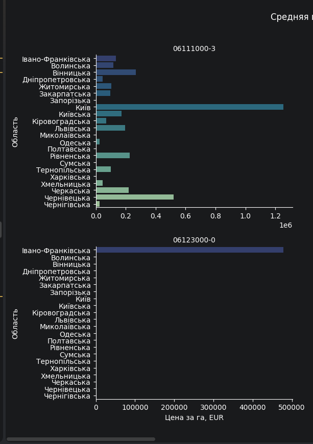
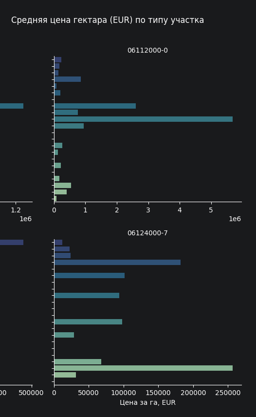
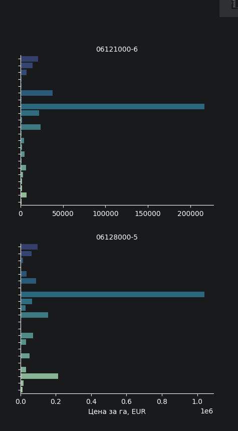

---

**Задание 4** — Средняя погрешность определения конечной стоимости земельного участка (в евро) экспертом в зависимости от типа целевого предназначения участка.

Реализация:
- Абсолютная погрешность оценки (`eval_error_abs_eur`) — модуль разницы между конечной ценой продажи и экспертной оценкой, в евро
- Группировка по `additional_classificator`, среднее по абсолютной погрешности, сортировка по убыванию
- Визуализация — `sns.barplot` по топ-10 самым частым кодам целевого назначения

Ответ: по коду `12` средняя погрешность оценки — `NaN`. Причина честная, не связана с ошибкой в расчёте: по этому коду в датасете всего 2 лота, и у обоих `expert_eval_price` отсутствует (не проставлена экспертная оценка), поэтому погрешность физически не может быть вычислена.

Отдельное наблюдение по качеству данных, важное для дальнейшего анализа (пригодится и в части 4): коды `additional_classificator` размечены в базе непоследовательно по формату — вперемешку встречаются двузначные коды без десятичной части (`01`, `11`, `12`) и полноценные коды вида `001.00`, `011.01`, `02.10`. Судя по всему, разные партии данных заполнялись по разным стандартам кодирования; коды без десятичной части, скорее всего, означают «тип определён только на уровне общей категории, без уточнения подкатегории», а не самостоятельный отдельный код. Для данного задания это не критично, но при более глубоком анализе конкретного типа эту неоднородность стоит учитывать.

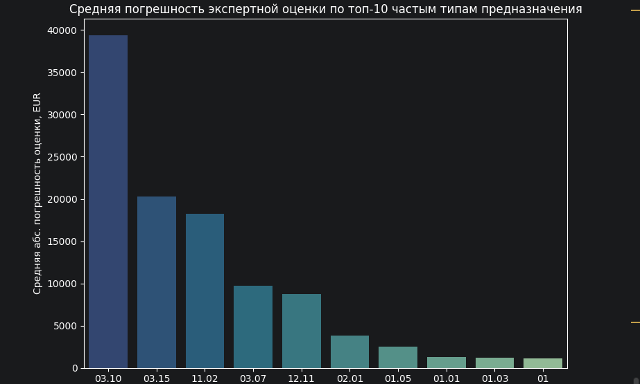

---

**Задание 5** — Для каждой области — продавец(-ы), выставившие максимальное количество лотов, и их суммарная конечная стоимость (в евро).

Реализация:
- Группировка `['oblast', 'customer_edrpou']`, агрегаты `lots_count` (число лотов) и `total_sale_eur` (сумма `sale_price_eur`)
- Для каждой области отобраны строки с максимумом `lots_count` через `groupby('oblast')['lots_count'].transform('max')` — с учётом возможных нескольких лидеров с одинаковым числом лотов
- Расшифровка `customer_edrpou` → название продавца через merge со справочником `customers`
- Визуализация — `sns.barplot` по количеству лотов у лидера (Миколаївська область исключена из графика отдельно, см. ниже)

Ответ: в 21 из 22 областей лидер определяется однозначно, например: Львівська — 20 лотов у одного продавца (сумма продаж ~6.05 млн EUR), Полтавська — 27 лотів (~168.7 тыс. EUR), Волинська — 23 лота (~1.36 млн EUR), Дніпропетровська — 25 лотів (~136.1 тыс. EUR), Кіровоградська — 13 лотів (~37.0 тыс. EUR).

Исключение — **Миколаївська область**: выделить лидирующего продавца невозможно — все 6 продавцов выставили ровно по одному лоту (следствие малого количества данных по области в целом — всего 6 лотов на всю область).

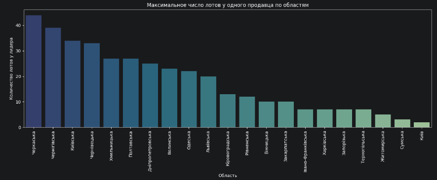

---

**Задание 6** — Земельные участки какого целевого предназначения обладают самой высокой конечной стоимостью за гектар (в евро).

Реализация:
- Группировка по `additional_classificator`, среднее по `price_per_ha_eur` и число лотов (`lots_count`) в каждой группе — для контроля надёжности выборки
- Визуализация — `sns.barplot` по топ-10 кодов с подписью `n=<число лотов>` над каждым столбцом

Ответ: формальный лидер — код **`02.10`** («для будівництва і обслуговування багатоквартирного житлового будинку з об'єктами торгово-розважальної та ринкової інфраструктури», земли под многоквартирную жилую застройку с торгово-развлекательной инфраструктурой) — средняя цена **~773.4 тыс. EUR/га**, но всего **7 лотов**, то есть результат опирается на малую выборку. С поправкой на надёжность стоит также выделить код **`03.07`** («для будівництва та обслуговування будівель торгівлі», здания торговли) — **~667.1 тыс. EUR/га**, но уже на **204 лотах**, то есть статистически наиболее устойчивый результат в этом ценовом сегменте.

Оба лидера объединяет общая логика: земля под коммерческую или жилую застройку стоит на порядок дороже сельскохозяйственной или промышленной, что и определяет верхний ценовой сегмент рынка (для сравнения: у чисто сельскохозяйственного кода `06121000-6`, самого массового типа по всей базе, средняя цена за га находится значительно ниже топ-10 из этого рейтинга).

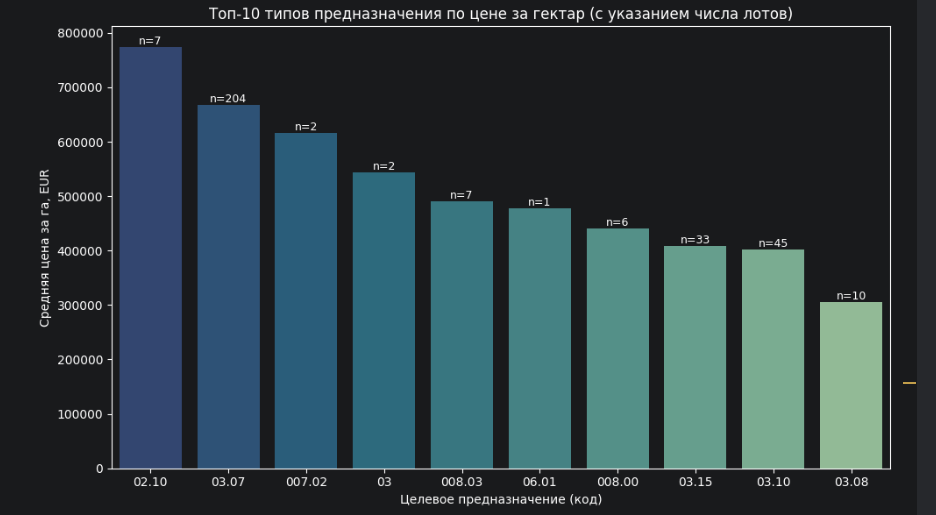


# Часть 4. Элементы самостоятельного анализа данных и выводы

---

**Задание 1** — Выбор области и типа земельного участка по классификатору.

Для дальнейшего анализа выбраны **Київ** и тип участка **`06111000-3`** (землі житлової забудови). Причина интереса: в части 3 именно эта пара показала самую высокую среднюю цену за гектар среди всех областей (~1.25 млн EUR/га) — и это закономерно: Киев как столица имеет самый плотный и дорогой рынок земли под жилую застройку в стране, что отражается и на цене малых по площади участков (0.02–0.4 га), которые формируют эту выборку. Интересно проверить, насколько устойчива эта «столичная премия» во времени и подтверждается ли она на более широком срезе.

```python
subset = auctions[
    (auctions['oblast'] == 'Київ') &
    (auctions['classificator'] == '06111000-3')
].copy()
```

Выборка оказалась крайне маленькой — **всего 3 лота** (все три поданы в 2023 году). Из-за этого задания 2–6 выполнены в двух версиях:
- **основная** — строго по условию задания (Київ + `06111000-3`, n=3);
- **дополнительная** — по всему Києву без сужения по типу участка (n=6), для более содержательной картины.

---

**Задание 2** — Целевое предназначение, которое чаще всего выставляется на продажу.

*Основная выборка (n=3):* явного лидера нет — у всех трёх лотов разные коды `additional_classificator` (`02.09`, `001.00`, `02.01`). Статистика здесь не репрезентативна.

*Полный Київ (n=6):* по `additional_classificator` тоже все 6 кодов уникальны, повторов нет. Но по основному `classificator` (тип участка) лидер есть: **`06111000-3` (житлова забудова) — 3 из 6 лотов**, ровно вдвое чаще любого другого типа. Это подтверждает обоснованность выбора в задании 1 — жилая застройка действительно самый ходовой тип земли в Києві.

| Дата | Тип (classificator) | Код назначения | Расшифровка | Площадь, га | Цена, EUR | Цена/га, EUR |
|---|---|---|---|---|---|---|
| 2022-01-10 | 06112000-0 (громадська) | `03.07` | Будівлі торгівлі | 0.05 | 130,257.83 | 2,605,156.62 |
| 2023-01-04 | 06111000-3 (житлова) | `02.01` | Житловий будинок (присадибна ділянка) | 0.10 | 31,916.74 | 319,167.41 |
| 2023-07-27 | 06121000-6 (с/г) | `01` | Землі с/г призначення (загальна категорія) | 0.06 | 12,853.56 | 216,389.88 |
| 2023-08-01 | 06111000-3 (житлова) | `001.00` | Рілля | 0.02 | 30,384.01 | 1,519,200.63 |
| 2023-09-20 | 06128000-5 (промисловість) | `12.11` | Об'єкти дорожнього сервісу | 0.20 | 207,207.44 | 1,039,676.05 |
| 2023-09-20 | 06111000-3 (житлова) | `02.09` | Паркінги та автостоянки | 0.40 | 766,205.24 | 1,919,832.73 |

---

**Задание 3** — Какое целевое предназначение обладает самой высокой стоимостью за гектар (в евро), и почему.

*Основная выборка (n=3):* лидер — `02.09` (паркінги та автостоянки), **~1.92 млн EUR/га**. Вероятное объяснение: это единственный из трёх лотов, где абсолютная цена продажи (766 тыс. EUR) сама по себе значительная, а не только следствие малой площади (как у `001.00`, 0.02 га) — высокая цена за га подкреплена реальным крупным денежным оборотом. Земля под паркинг в жилой/общественной застройке столицы — дефицитный формат в уже плотно застроенном районе, что объясняет премию к цене.

*Полный Київ (n=6):* лидер — **`03.07` (будівлі торгівлі), ~2.6 млн EUR/га**, что выше топа узкой выборки. Коммерческая недвижимость (торговля) в плотной застройке столицы стоит дороже даже жилой — земля под магазин/ТЦ в центре генерирует больше денежного оборота на единицу площади, чем жилая или парковочная.

---

**Задание 4** — Количество лотов в зависимости от года/месяца, линейный график, предположение о причине, попытка прогноза.

Реализация: `auction_date` приведена к месяцу (`dt.to_period('M')`), количество лотов по месяцам дополнено нулями по полному диапазону дат датасета (`reindex(full_range, fill_value=0)`), построен линейный график.

*Основная выборка (n=3):* два коротких всплеска по 1 лоту — январь 2023 и август–сентябрь 2023, всё остальное время 0. Предположение о причине: при n=3 говорить о закономерности/сезонности нельзя — единичные сделки, не поток. Единственное наблюдение: ни одной сделки не было в 2021 и почти весь 2022 год — вероятно, рынок жилой застройки в Киеве в 2022 году (начало полномасштабного вторжения) был заморожен, активность вернулась только во второй половине 2023. Прогноз на трёх точках технически бессмысленен — линейная экстраполяция дала бы ложную точность.

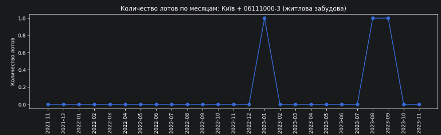

*Полный Київ (n=6):* та же картина, но с тремя всплесками вместо двух (добавляется январь 2022) и ростом амплитуды к концу периода (2 лота в сентябре 2023 против 1 в более ранние пики) — то есть намёк на нарастающую активность рынка к концу горизонта данных, что согласуется с общим трендом по всей базе (часть 2, задание 3).

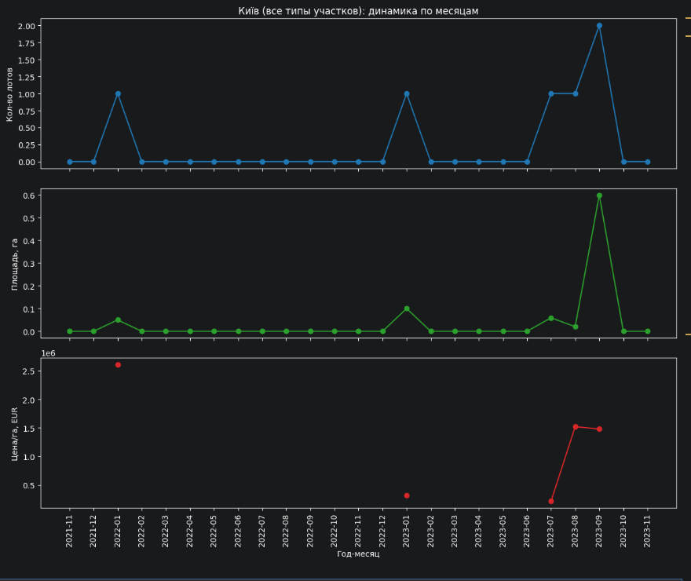

---

**Задание 5** — Динамика суммарной площади лотов в зависимости от года/месяца.

*Основная выборка (n=3):* форма графика повторяет задание 4 (те же два месяца), но в гектарах: пик 0.10 га (январь 2023) и пик 0.40 га (сентябрь 2023, за счёт лота под паркинг), остальное — 0.

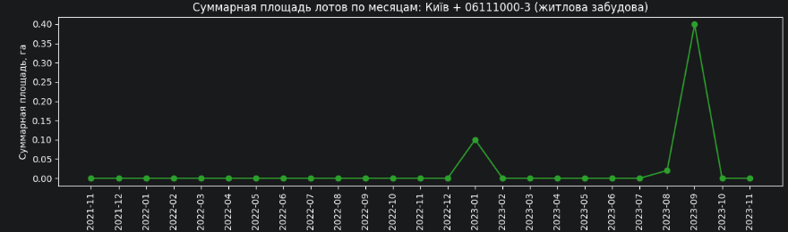

*Полный Київ (n=6):* см. средняя панель на комбинированном графике выше (задание 4) — тот же паттерн с добавлением января 2022 (0.05 га) и заметным пиком в сентябре 2023 (0.6 га суммарно, за счёт двух лотов в этом месяце).

---

**Задание 6** — Динамика средней конечной стоимости участка за гектар (в евро) в зависимости от года/месяца, линейный график.

Важный нюанс методики: в отличие от количества лотов и площади, среднюю цену за гектар **некорректно заполнять нулём** для месяцев без сделок — отсутствие сделки не означает нулевую стоимость земли, это просто отсутствие наблюдения. Поэтому пропуски оставлены как `NaN` (без `fill_value`), и на графике `matplotlib` автоматически разрывает линию — отсюда отдельные точки и короткие отрезки только там, где в датасете реально были продажи.

*Полный Київ (n=6):* нижняя панель на комбинированном графике (задание 4). Видно: единичный ранний выброс в январе 2022 (~2.6 млн EUR/га, код `03.07`), провал в середине 2023 (агроучасток, ~216 тыс.), и рост к августу–сентябрю 2023 (~1.5–1.9 млн EUR/га) — восходящий тренд к концу периода, согласующийся и с ростом количества лотов на первой панели.

---

**Задание 7** — Выводы по состоянию рынка земельных участков.

Рынок земельных участков Украины за исследуемый период (нояб. 2021 — нояб. 2023) отчётливо разделён войной на «до» и «после»: резкий структурный сдвиг по годам и количеству лотов виден почти во всех областях (часть 2, задание 3), а на примере Киева — заморозка сделок в течение почти всего 2022 года и восстановление активности только во второй половине 2023-го. Цена земли сильно расслаивается не столько по географии, сколько по назначению участка: коммерческая и жилая застройка в столице стоит на 1–2 порядка дороже сельскохозяйственной или промышленной земли (до 2.6 млн против ~200 тыс. EUR/га), и эта премия только растёт к концу периода. В целом рынок остаётся небольшим и волатильным (единичные сделки в месяц даже по такому крупному городу, как Киев), поэтому точечные выводы по узким срезам стоит воспринимать как иллюстрацию, а не статистически устойчивый тренд.