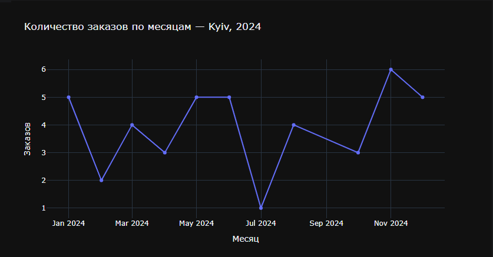

**Для базы данных продажи квартир (`appatments.db`)**

**Задание 1** — В каком городе было продано больше всего двухкомнатных квартир в 2023 году.

Реализация:
- Датой продажи условно взята дата публикации объявления (`first_day_exposition`), а не дата снятия (`first_day_exposition + days_exposition`) — при расчёте через дату снятия ни одна квартира в датасете не "продаётся" раньше 2024 года (у самой ранней записи, от января 2021-го, `days_exposition` = 1580 дней), поэтому вопрос про 2023 год с честной датой продажи не имеет ответа на этих данных
- SQL: `WHERE rooms = 2 AND strftime('%Y', first_day_exposition) = '2023'`, группировка по `locality_name`, сортировка по количеству по убыванию

Ответ: **Kyiv** — 414 квартир, с большим отрывом от остальных (Boryspil — 36, Vyshneve и Hostomel — по 34).

---

**Задание 2** — Оценить динамику продаж 3-комнатных квартир в Киеве по годам.

Реализация:
- Год продажи взят из той же колонки `first_day_exposition` (см. допущение в задании 1)
- SQL: `WHERE rooms = 3 AND locality_name = 'Kyiv'`, группировка по `strftime('%Y', first_day_exposition)`

Ответ: 2021 — 2, 2022 — 23, 2023 — 348, 2024 — 681.

---

**Задание 3** — В каком городе было последнее объявление из набора данных.

Реализация:
- SQL: находим `MAX(first_day_exposition)` по всей таблице и выбираем все строки с этой датой

Ответ: последняя дата в датасете — 23.12.2024, объявления в этот день были сразу в двух городах — **Boryspil** и **Kyiv**.

---

**Для базы данных заказов и клиентов (`orders_by_time_and_customers.db`)**

**Задание 1** — Зависимость количества заказов от населённого пункта в марте 2024 года.

Реализация:
- `JOIN orders` и `customers` по `CustomerID`, фильтр `strftime('%Y-%m', order_date) = '2024-03'`, группировка по `Location`

Ответ: Kyiv — 4 заказа, Brovary — 1, Boryspil — 1. В остальных городах заказов в марте 2024 не было.

---

**Задание 2** — График зависимости количества заказов от месяца для Киева.

Реализация:
- SQL: фильтр `Location = 'Kyiv'`, группировка по `strftime('%Y-%m', order_date)`
- График построен через `plotly.express.line`

---

**Задание 3** — В каком городе купили больше всего игровых клавиатур в августе 2024 года?

Реализация:
- SQL: фильтр `Description = 'Gaming Keyboard'` и `strftime('%Y-%m', order_date) = '2024-08'`, группировка по `Location`

Ответ: заказов Gaming Keyboard в августе 2024 года не было ни в одном городе — запрос возвращает пустую таблицу (продажи этого товара в датасете есть только в январе, феврале, марте, апреле, июне, июле, октябре и ноябре 2024-го).