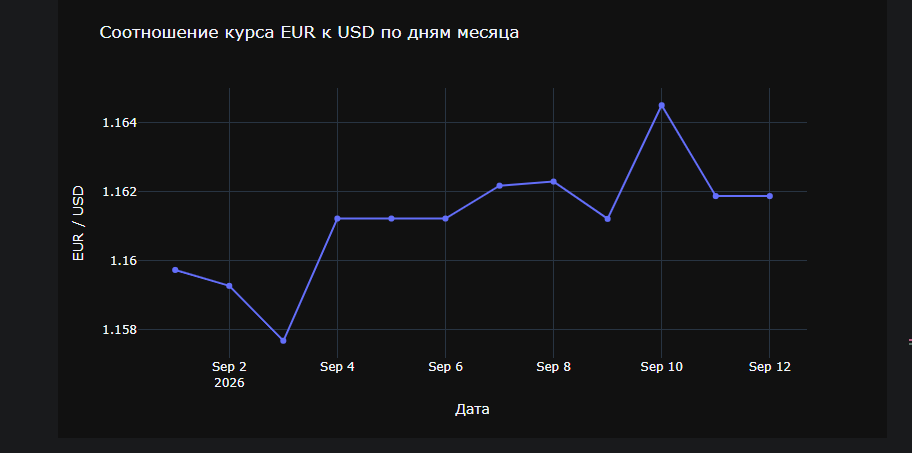

**Задание 1** — С сайта НБУ получить курсы доллара и евро за текущий месяц (запросы на каждый день месяца), построить график соотношения курса евро к курсу доллара по дням.

Реализация: цикл по датам от 1-го числа месяца до сегодня, на каждой итерации — запрос к `bank.gov.ua/ua/markets/exchangerates?date=...&period=daily`, парсинг таблицы `#exchangeRates` через BeautifulSoup, извлечение курсов USD и EUR.

Ответ: соотношение EUR/USD весь месяц держится в диапазоне ~1.158–1.166, с провалом 3 сентября и резким пиком 10 сентября — в остальные дни колебания плавные. Плоские участки на графике — выходные, когда НБУ не пересчитывает курс.

**Задание 2** — Создать список ресурсов в сети интернет и проверить их на доступность.

Реализация: список из 5 рабочих сайтов + 2 заведомо нерабочих (несуществующий домен и битая страница), проверка через `requests.get()` с обработкой `status_code` и исключений.

Ответ:
- `bank.gov.ua`, `dou.ua`, `privatbank.ua` — доступны, код 200
- `rozetka.com.ua`, `olx.ua` — сервер отвечает, но блокирует запрос (403, защита от ботов)
- `bank.gov.ua/nonexistent-page-404` — сервер отвечает, страницы не существует (404)
- несуществующий домен — недоступен (ошибка DNS-резолвинга)

**Задание 3** — Сохранить в отдельный файл все ссылки на свежие публикации с главной страницы DOU.UA.

Реализация: запрос главной страницы, поиск всех `<a href>`, фильтрация по маркеру `from=recent` в ссылке (характерен именно для блока "Свіже" на главной), удаление дублей, сохранение в CSV.

Ответ: найдено 8 свежих публикаций, сохранено в `dou_fresh_articles.csv` (колонки `title`, `url`).