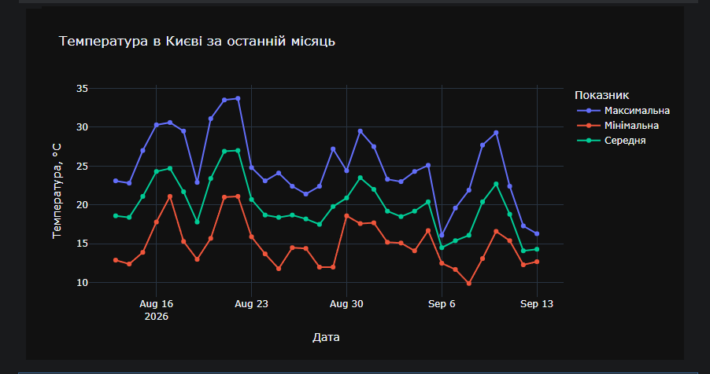

**Задание 1** — Считать файл `catalog.xml` используя стандартную библиотеку Python для чтения XML и используя Pandas.

Реализация:
- через `xml.dom.minidom` — обход дерева тегов вручную (`getElementsByTagName`, `.attributes`, `.childNodes[0].data`), отдельно для каждого `<product>`
- через `pandas.read_xml("data/catalog.xml", parser="etree")` — прямое чтение в DataFrame одной строкой

---

**Задание 2** — Использовать открытый API [open-meteo.com](https://open-meteo.com/en/docs) для получения температуры за каждый день последнего месяца для расположения, близкого к своему населённому пункту. Построить график зависимости температуры от дня.

Локация: Київ (`latitude=50.4501, longitude=30.5234`)

Реализация: запрос к `api.open-meteo.com/v1/forecast` с параметром `past_days=31` (даёт свежую историю без задержки, характерной для архивного API), поля `temperature_2m_max/min/mean`; отфильтрован хвост из прогнозных дней вперёд, оставлены только прошедшие даты (32 дня, 13.08–13.09).

