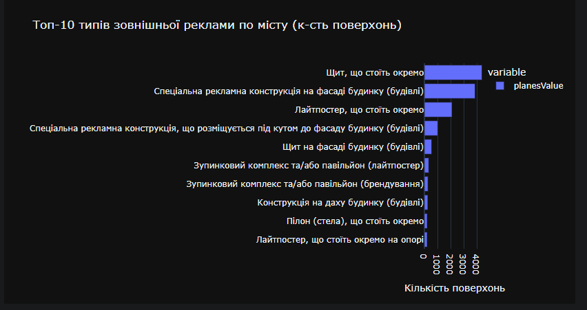
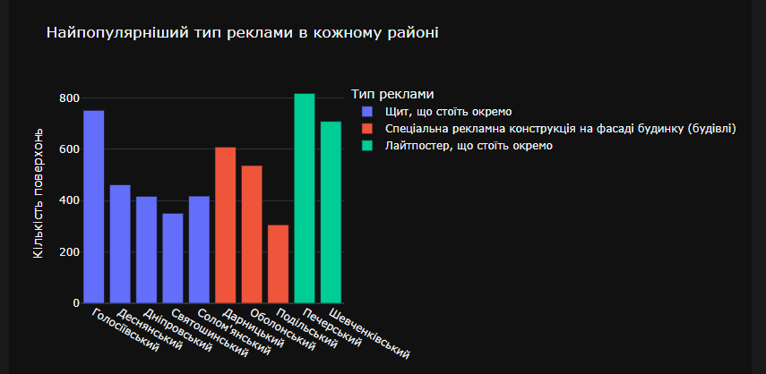
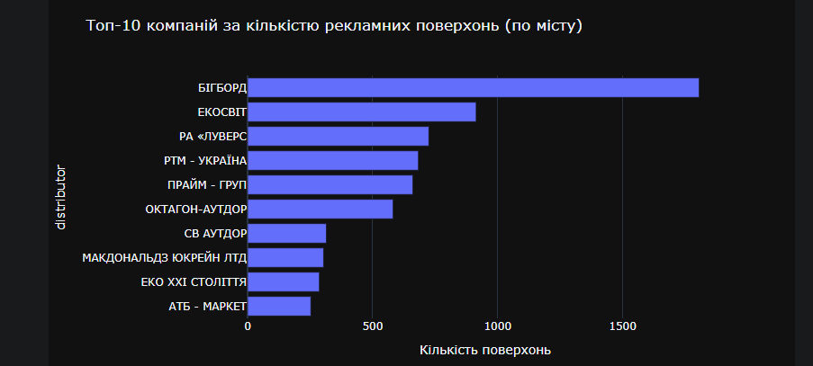
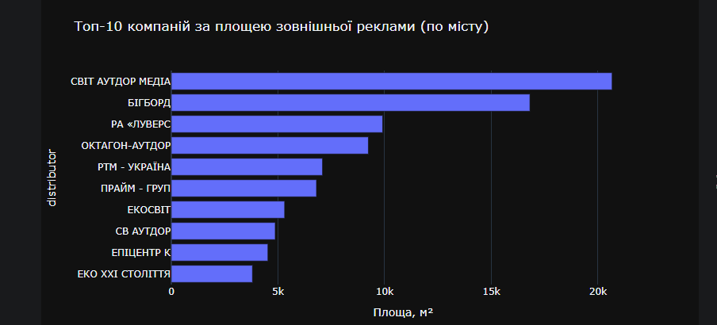
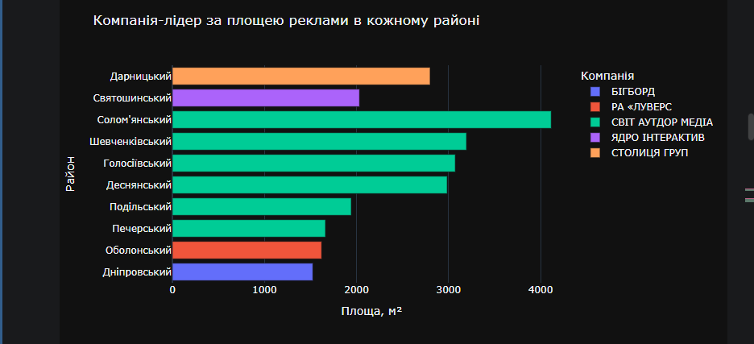
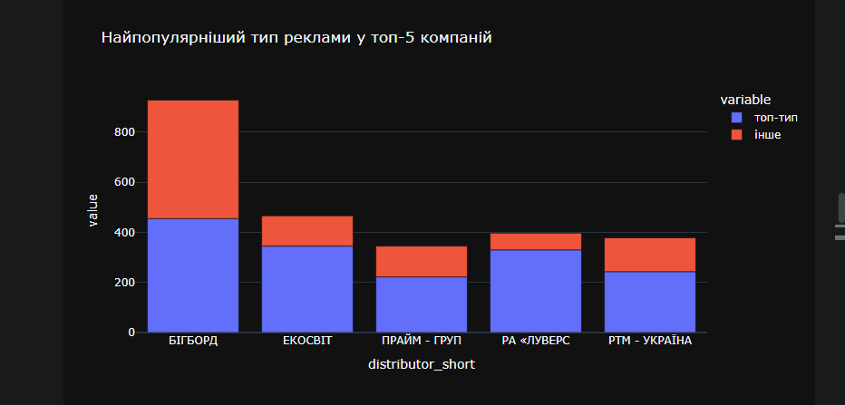
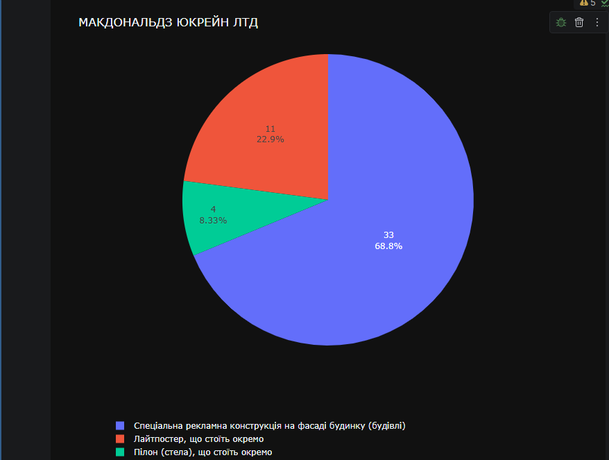
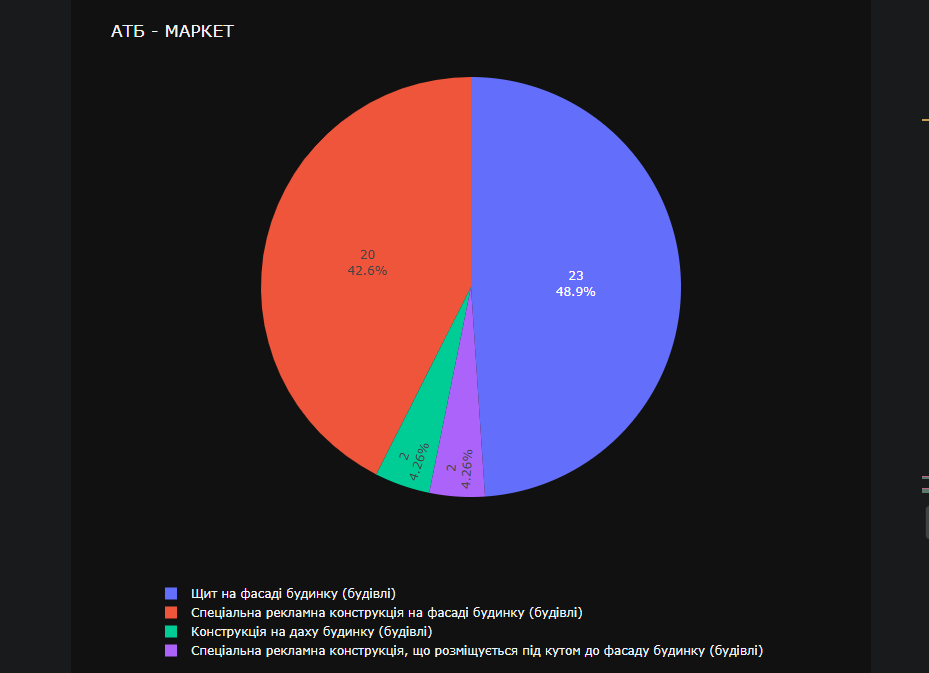
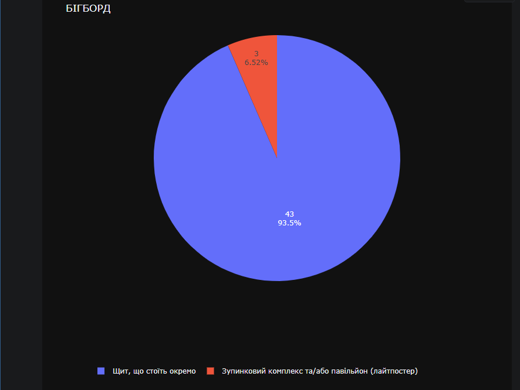
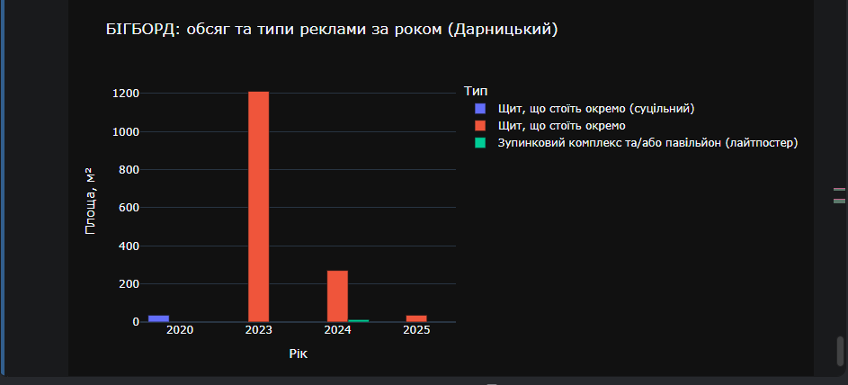

# ДЗ — Аналіз ринку зовнішньої реклами м. Києва

**Легенда:** аналіз проводиться в інтересах компанії-виробника елементів зовнішньої реклами.
Мета — визначити перспективних клієнтів (розповсюджувачів) і напрямок (район/тип реклами), на якому варто зосередитись.

**Дані:** `reclamni_zosobi-info.csv` (договори на розміщення реклами) + `distributor-info.csv` (довідник компаній-розповсюджувачів).

---

## Задача 1. Завантаження та первинна обробка даних

- Зчитано обидва файли (`distributor-info.csv` — 2259 рядків, `reclamni_zosobi-info.csv` — 15 924 рядки).
- Рядки з пропусками в `planesValue`, `horizontalSize`, `verticalSize` видалено → залишилось **15 908** договорів.
- Типізація колонок: `status`, `type`, `district` → `category`; дати (`issuedDate`, `validFrom`, `validThrough`) → `datetime64`.
- Побудовано EDA-звіт (`data_profiling`/ydata-profiling) для загального огляду розподілів.
- **Пошук викидів**: за IQR-правилом (3×IQR) в межах кожного типу реклами позначено **819 із 15 908** договорів як викиди (~5%) по `horizontalSize`, `verticalSize`, `area`, `planesValue`.
  - Додатково перевірено співвідношення сторін (`verticalSize / horizontalSize`) — знайдено 323 підозрілих записи з екстремальним співвідношенням, з них 4 — це вже відомі "нестандартні" типи (кронштейни та ін.), де таке співвідношення є нормою, а не помилкою.
- **Перевірка актуальності статусу договору**: поле `status` в джерелі майже завжди `"Чинний"`, тому воно **не відображає реальну дію договору**. Порівняння з датою закінчення (`validThrough`) на поточну дату показало:

| status = "Чинний" | Дійсний зараз | Недійсний (термін минув) |
|---|---:|---:|
| Кількість договорів | **9 753** | **6 155** |

  → тобто **майже 39% договорів зі статусом "Чинний" фактично вже прострочені** — для подальшого аналізу використовувався реально розрахований статус (`status_actual`), а не поле з джерела.

---

## Задача 2. Відповіді на ключові питання

### 2.1. Які типи зовнішньої реклами найпопулярніші по всьому місту?

Серед діючих договорів лідирують окремо розташовані щити та спецконструкції на фасадах будинків:

Абсолютний лідер — **«Щит, що стоїть окремо»** (4396 поверхонь), далі **«Спеціальна рекламна конструкція на фасаді будинку»** (3867) і **«Лайтпостер, що стоїть окремо»** (2106).

### 2.2. Які типи популярні в розрізі районів?

Картина неоднорідна: у Печерському, Голосіївському та Шевченківському домінують лайтпостери/окремі щити, тоді як у **Дарницькому, Оболонському та Подільському** лідирує **«Спеціальна рекламна конструкція на фасаді будинку»**.

### 2.3. Які компанії використовують найбільше зовнішньої реклами по місту (у штуках)?

Беззаперечний лідер за кількістю — **«БІГБОРД»** (1806 поверхонь), із суттєвим відривом від другого місця («ЕКОСВІТ», 914).

### 2.4. Ті самі компанії, але за площею реклами

За площею лідер уже інший — **«СВІТ АУТДОР МЕДІА»** (20 663 м²), і лише потім «БІГБОРД» (16 809 м²). Це означає, що «СВІТ АУТДОР МЕДІА» працює з меншою кількістю, але значно більшими конструкціями.

### 2.5. Компанія-лідер за площею в кожному районі

«СВІТ АУТДОР МЕДІА» лідирує в більшості районів міста, окрім **Дарницького** (лідер — «СТОЛИЦЯ ГРУП»), **Дніпровського** («БІГБОРД»), **Оболонського** («РА «ЛУВЕРС») та **Святошинського** («ЯДРО ІНТЕРАКТИВ»).

### 2.6. Договори, термін дії яких закінчується найближчим часом

Топ-20 найближчих до завершення діючих договорів по місту — переважно з термінами 0–4 дні (тобто такі, що ось-ось стануть недійсними), серед розповсюджувачів — «СІТІЗЛАЙТ», «СІЛЬПО», «СВІТ АУТДОР МЕДІА», «СОФТКАР», «КЛІНІКА МЕДІКОМ» та інші. Це готовий список для першочергового контакту щодо продовження/оновлення конструкцій.

### 2.7. Улюблений тип реклами топ-5 компаній-лідерів
 

 
Сам графік показує лише співвідношення "топ-тип / інше" в кількісному вираженні, без назви типу (`px.bar(chart_df)` будує стовпчики по значеннях `ct.max(axis=1)` і залишку, а назва типу з `idxmax(axis=1)` в `chart_df` не потрапляє). Тому конкретний тип-лідер по кожній компанії — окремо, текстом:
 
| Компанія | Топ-тип реклами | Кількість |
|---|---|---:|
| БІГБОРД | Щит, що стоїть окремо | 455 |
| ЕКОСВІТ | Лайтпостер, що стоїть окремо | 345 |
| РА «ЛУВЕРС» | Щит, що стоїть окремо | 330 |
| РТМ - УКРАЇНА | Щит, що стоїть окремо | 243 |
| ПРАЙМ - ГРУП | Щит, що стоїть окремо | 222 |
 
У 4 з 5 лідерів переважний тип — «Щит, що стоїть окремо», і лише «ЕКОСВІТ» тяжіє до лайтпостерів. У кожної компанії топ-тип чітко переважає над іншими (значно частіше за інші) — тобто в закупівлях є явний "профільний" формат, а не рівномірний розподіл по типах. Найяскравіше це видно у «БІГБОРД»: майже половина всіх його договорів — саме цей тип конструкції.
 
---

## Задача 3. Поглиблений аналіз обраного району

**Обраний район: Дарницький.**

Дарницький — один із найбільших районів Києва за площею, а отже і потенціал під зовнішню рекламу (кількість фасадів, транспортних вузлів, торгових об'єктів) там об'єктивно більший, ніж у компактніших центральних районах. Особисто цей район ще й близький мені — я жив там до переїзду за кордон.

### 3.2. Топ-3 компанії-лідери в Дарницькому районі (за кількістю договорів)

| Компанія | Кількість договорів |
|---|---:|
| МАКДОНАЛЬДЗ ЮКРЕЙН ЛТД | 48 |
| АТБ-МАРКЕТ | 47 |
| БІГБОРД | 46 |

### 3.3. Переважні типи реклами цих трьох компаній

| МАКДОНАЛЬДЗ ЮКРЕЙН ЛТД | АТБ-МАРКЕТ | БІГБОРД |
|---|---|---|
 

МакДональдз і АТБ використовують рекламу переважно одного-двох форматів (вивіски/спецконструкції на власних об'єктах), тоді як «БІГБОРД» як медіа-майданчик працює з ширшим набором типів конструкцій.

### 3.4. Динаміка середньої площі однієї реклами за роками (Дарницький)

### 3.5. Кейс однієї компанії: «БІГБОРД» у Дарницькому районі

Видно, як змінювався сумарний обсяг (площа) розміщень «БІГБОРД» по роках і як зсувався мікс типів конструкцій — це дає уявлення про те, як компанія нарощувала/змінювала свою присутність у районі з часом.

---

## Задача 4. Рекомендації

**На чому зосередитись:** район **Дарницький**, тип конструкції — **«Спеціальна рекламна конструкція на фасаді будинку (будівлі)»** (саме цей формат лідирує там за кількістю поверхонь, п.2.2) — під нього варто пропонувати виробництво/оновлення елементів у першу чергу.

**Кому пропонувати послуги найближчим часом:**
- Компанії зі списку найближчих закінчень договорів (п.2.6) — їм у прямому сенсі скоро знадобиться або продовження, або заміна конструкцій.
- Топ-3 лідери Дарницького (МакДональдз Юкрейн, АТБ-Маркет, БІГБОРД) — як активні та регулярні замовники в цільовому районі.

---

## Про графіки в цьому README

Усі графіки вище — це кропи моїх власних скріншотів з ноутбука (папка `imgs/`), обрізані по межі самого графіка, без коду та інтерфейсу IDE.
